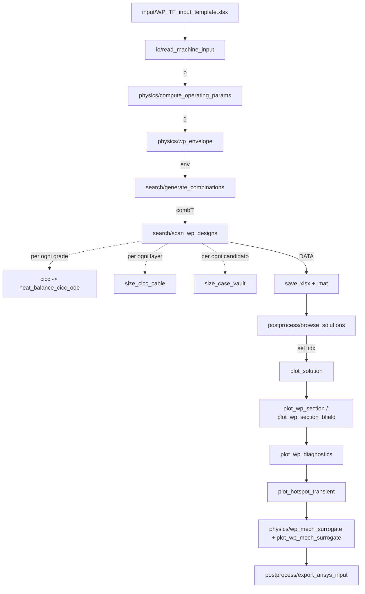

# MADE 2.0 – Dimensionamento del winding pack TF: guida al codice e modello meccanico surrogato

*Report tecnico – settembre 2026. Riferito al branch `claude/code-improvement-3cmng0`.*

Questo documento spiega **a cosa serve ogni funzione** della cartella `MADE-2.0/matlab`, **come si collegano** tra loro, e descrive **nel dettaglio il modello meccanico surrogato** (FE 2D) con la sua validazione contro ANSYS.

---

## Indice

1. [In breve: cosa fa il codice](#1-in-breve-cosa-fa-il-codice)
2. [Come si usa (4 scenari)](#2-come-si-usa-4-scenari)
3. [Mappa delle cartelle e delle funzioni](#3-mappa-delle-cartelle-e-delle-funzioni)
4. [Strutture dati che passano tra le funzioni](#4-strutture-dati-che-passano-tra-le-funzioni)
5. [La scansione del design space, passo per passo](#5-la-scansione-del-design-space-passo-per-passo)
6. [Modelli fisici di supporto: campo, conduttore, hot spot](#6-modelli-fisici-di-supporto)
7. [Il modello meccanico surrogato (FE 2D) in dettaglio](#7-il-modello-meccanico-surrogato-fe-2d)
8. [Validazione contro ANSYS](#8-validazione-contro-ansys)
9. [Limiti noti e punti aperti](#9-limiti-noti-e-punti-aperti)

---

## 1. In breve: cosa fa il codice

Dato un file Excel con i parametri della macchina, il codice:

1. **esplora** tutte le combinazioni ammissibili di spessore laterale del case × numero di layer × turn per layer (*scan*);
2. per ogni combinazione **dimensiona** il conduttore CICC di ogni *grade* (superconduttore, rame, hot spot), il jacket, il case (nose), con **modelli analitici veloci**;
3. **salva** tutte le soluzioni fattibili, le **mostra** e fa scegliere quella da approfondire;
4. sulla soluzione scelta esegue le **verifiche di dettaglio**: sezione, campo magnetico reale (Biot–Savart discreto), transitorio di hot spot, **equilibrio meccanico con il modello FE surrogato**, ed eventualmente l'**export in ANSYS**.

Il principio è a due livelli: **modelli analitici rapidi nella scansione** (milioni di valutazioni), **modelli accurati e validati solo sulla soluzione scelta**.

---

## 2. Come si usa (4 scenari)

| Scenario | Cosa lanciare | Note |
|---|---|---|
| **Nuova macchina / nuova scansione** | `main_WP_TF_design` | Chiede il file Excel, lo fa rivedere, scansiona (con barra di avanzamento), salva `<tag>_results_<data>.xlsx` + `.mat`, fa scegliere la soluzione, produce i plot, chiede se eseguire il surrogato meccanico e l'export ANSYS. |
| **Rivedere una soluzione già salvata** | `[row,p] = load_design_point('<file>_results_<data>.xlsx', idx);` poi le funzioni di plot o `wp_mech_surrogate(row,p)` | Usa il `.mat` gemello se presente (ricarica esatta). |
| **Configurazione manuale "what-if"** (senza scan) | `postprocess/plot_wp_section_manual_example.m` | Si scrivono a mano turn, layer, dimensioni; il conduttore di ogni grade viene dimensionato con `cicc`; esegue tutti i plot e il surrogato meccanico. |
| **Validazione contro FEM** | `validation/validate_mech_surrogate_2026.m` (surrogato), `validate_TF_FEM_design7_2026.m` e `validate_TF_FEM_benchmark_2026.m` (modello analitico) | Confronti numerici con i risultati ANSYS; i risultati sono riassunti in `validation/TF_FEM_benchmark_2026_findings.md`. |

**Per progettare un'altra macchina non si modifica il codice**: si copia `input/WP_TF_input_template.xlsx`, si cambiano i valori (colonna *Value*) e si punta il main a quel file. Tutti i parametri indipendenti sono lì (74 in totale, divisi per categoria).

---

## 3. Mappa delle cartelle e delle funzioni

### 3.1 Punto di ingresso

| File | A cosa serve |
|---|---|
| `main_WP_TF_design.m` | Script principale. Esegue l'intera catena della figura sopra. Non contiene parametri: tutto viene dall'Excel. |

### 3.2 `io/` – lettura dell'input

| Funzione | A cosa serve | Input → Output |
|---|---|---|
| `read_machine_input` | Legge il foglio *Input* dell'Excel (colonne Name/Value) e crea la struct `p` con un campo per parametro. Verifica che ci siano tutti i parametri obbligatori e che siano numerici. | `xlsx_path` → `p` |

### 3.3 `physics/` – modelli fisici

| Funzione | A cosa serve | Usata da |
|---|---|---|
| `compute_operating_params` | Grandezze derivate comuni a tutti i candidati: raggi della gamba interna/esterna (`RTFi`, `RTFo`), corrente totale `NI`, campo di picco "smeared" `B_PHI_TF`, fattori del modello a guscio senza flessione (`k_bf`, `r_bf`), tempo di scarica limitato dal vessel. | main, surrogato (per `T_bf`) |
| `wp_envelope` | Inviluppo del WP: larghezza del case, intervallo dello spessore laterale del case, limiti su turn per layer e numero di layer che delimitano la scansione. | main |
| `size_cicc_cable` | Dimensiona la sezione CICC di un layer: aumenta lo spessore del jacket `JT` finché la tensione radiale di membrana (formula analitica a rigidezze in serie/parallelo) scende sotto l'ammissibile. Il raggio di raccordo del cavo è `r_SC = JT` limitato a `[r_SC_min, r_SC_max]`. | scan |
| `size_case_vault` | Dimensiona lo spessore del nose `DTF` finché la tensione di Tresca del *vault* (anello del case) e del jacket più interno rispettano gli ammissibili (modello analitico a rigidezze accoppiate WP/case). | scan |
| `compute_discrete_field_profile` | Campo magnetico **reale** su ogni turn: ogni cavo della bobina analizzata è un rettangolo a corrente uniforme (Biot–Savart analitico, include l'auto-campo), le altre `n_TF−1` bobine sono filamenti. Restituisce il picco su ogni cavo e il confronto con il modello smeared. Validato: 14.47 T contro 14.48 T del FEM. | plot di campo, diagnostica |
| `wp_field_at_points` | Stesso modello di campo, ma valutato in punti arbitrari (serve al surrogato meccanico per le forze di Lorentz). | surrogato |
| `wp_mech_surrogate` | **Modello meccanico FE 2D** della sezione (capitolo 7). | main passo 5b, esempio manuale, validazione |

### 3.4 `search/` – scansione

| Funzione | A cosa serve |
|---|---|
| `generate_combinations` | Per ogni numero di layer ammesso, genera le combinazioni "stessi turn in ogni layer" il cui totale di turn è compatibile con la corrente (`Iop_min…Iop_max`). |
| `scan_wp_designs` | Il cuore della scansione (capitolo 5). Restituisce la tabella `DATA` con una riga per soluzione fattibile. Stampa l'avanzamento (analizzate, passate, rimanenti, tempo stimato). Funzioni interne: `pick_jump_grades` (dove cambia il grade), `pick_E_cbl` (modulo del cavo LTS/HTS), `size_grade_cable` (adattatore verso `size_cicc_cable`), `format_hms`. |

### 3.5 Conduttore (radice della cartella, funzioni originali)

| Funzione | A cosa serve |
|---|---|
| `cicc` | Dimensiona **un grade** di conduttore al campo `B`: sceglie il superconduttore (Nb3Sn / NbTi sotto 6 T / REBCO; ibrido: HTS sopra 15 T), calcola il numero di strand/tape `N_Sc = ceil(Iop/Ic)`, poi cerca per bisezione il numero di fili di rame `N_Cu` che porta la temperatura di hot spot al limite (250 K LTS, 150 K HTS, dall'Excel). Restituisce anche l'area del cavo. |
| `cicc_params` | Costanti del conduttore condivise da `cicc` e dal plot di hot spot (diametro strand, Cu/nonCu, void fraction, canale di raffreddamento, soglie di campo, `Tau_delay`, limiti di default). |
| `heat_balance_cicc_ode` | ODE adiabatica di hot spot dopo un quench: corrente costante per `Tau_delay`, poi scarica esponenziale con `Tau_discharge`; resistività e calori specifici dipendenti da T e B. Restituisce `THS` e (opzionale) la storia `T(t)`. |
| `Ic_Nb3Sn` (+ `Ic_Nb3Sn_DTT_TF_KAT`, `_ITER`, `_WST`), `Ic_NbTi`, `Ic_sst33`, `jc_ybco` | Leggi di corrente critica per i vari strand/tape. `cicc` usa `Ic_Nb3Sn(…,'DTT_TF_KAT')`, `Ic_NbTi`, `Ic_sst33` (che chiama `jc_ybco`). |

### 3.6 `postprocess/` – risultati, plot, export

| Funzione | A cosa serve |
|---|---|
| `browse_solutions` | Tabella di tutte le soluzioni + scatter cliccabile (Iop vs Rk, colore = Tresca del vault); restituisce l'indice scelto. |
| `plot_solution` | Evidenzia la soluzione scelta sulla popolazione, stampa la riga e salva PNG + Excel della riga. |
| `plot_wp_section` | Sezione WP + case della soluzione (cavo, jacket, isolamento di spira, isolamento tra layer e di massa, case trapezoidale). |
| `plot_wp_section_bfield` | Stessa sezione con ogni cavo colorato dal campo di picco reale. |
| `plot_wp_diagnostics` | Profili per layer: campo smeared contro campo discreto, densità di corrente ingegneristica. |
| `plot_hotspot_transient` | Curva T(t) dell'hot spot per ogni grade (stessa ODE del dimensionamento) con limiti e riquadro riassuntivo (aree Cu/SC, Nsc/NCu, τ, Iop/Bop). |
| `plot_wp_mech_surrogate` | Mappa di Tresca della sezione (acciaio a colori, resto grigio), zoom sul WP con il picco, barre per layer di Pm, Pm+Pb e picco rispetto a Sm e 1.5·Sm; stampa la figura di merito. |
| `load_design_point` | Ricarica una soluzione salvata (da `.mat` esatto o da `.xlsx` ricomponendo le colonne-array). |
| `export_ansys_input` | Scrive il file parametri APDL che rigenera in ANSYS la geometria della soluzione scelta. |
| `plot_wp_section_manual_example` | Script-modello per una configurazione scritta a mano (vedi scenario 3). |

### 3.7 `validation/` – confronti con ANSYS

| File | A cosa serve |
|---|---|
| `validate_mech_surrogate_2026.m` | Esegue il surrogato sulle due geometrie FEM (benchmark e design 7) e confronta εz, picchi e sforzi linearizzati per layer, SCL del case con i valori ANSYS. |
| `validate_TF_FEM_design7_2026.m` | Confronto del **modello analitico** della scansione e del campo con il FEM del design 7. |
| `validate_TF_FEM_benchmark_2026.m` | Idem per il primo benchmark (è lo script con cui è stato calibrato `SCF_transition_provisional`). |
| `forward_eval_wp_stress.m` | Valuta le formule analitiche di jacket e case a geometria fissata (usata dagli script sopra). |
| `TF_FEM_benchmark_2026_findings.md` | Diario dei confronti con i numeri. |

### 3.8 File legacy (non usati dalla pipeline attuale)

Gli script originali monolitici sono conservati come riferimento e **non sono richiamati** dal main:
`WP_TF_*_Design_*.m`, `WP_TF_Esplorazione.m`, `PLOT_TF_*.m`, `Plot_WP_TF.m` (riferimento grafico originale), `CICC_CEFTR.m`, `CICC_DEMO.m`, `Ths_TF_Nb3Sn.m`, `Jc_REBCO.m`, `Ic_NbTi_TF.m`, `scf.m`, `xbr.m`, `xbz.m`, `xlm.m`, `xlsheet.m`, `ColorQuiver.m`.

---

## 4. Strutture dati che passano tra le funzioni

| Nome | Creata da | Contenuto |
|---|---|---|
| `p` | `read_machine_input` | Tutti i parametri dell'Excel (geometria macchina, materiali, ammissibili, dimensionamento WP, impostazioni numeriche, correzioni provvisorie, surrogato meccanico). |
| `g` | `compute_operating_params` | Grandezze derivate: `RTFi`, `RTFo`, `NI`, `B_PHI_TF`, `k_bf`, `r_bf`, `Tau_discharge1`, … |
| `env` | `wp_envelope` | `CASE_w`, intervallo `lateral_w`, `turns_comb`, `layers_comb`, limiti sul numero di turn. |
| `combT` | `generate_combinations` | Cell array: per ogni numero di layer, matrice delle combinazioni di turn per layer. |
| `DATA` | `scan_wp_designs` | Tabella, una riga per soluzione fattibile. Colonne scalari: `S_T_VT`, `S_T_JT`, `B_TF`, `Iop`, `JENG`, `L`, `E`, `Ri_`, `Rj_`, `Rk_`, `Nose`, `WP_h`, `WP_w`, `lateral_w`, `n_layers`, `Tau_discharge`, … Colonne-array (una voce per layer): `n_turns`, `type_cable`, `Cond_w`, `Cond_h`, `JT`, `N_Sc`, `N_Cu`, `S_Cable`, `THS`, `B_grade`, … |
| `row` | `DATA(idx,:)` oppure struct scritta a mano | Una soluzione; è l'input di tutte le funzioni di postprocess e del surrogato. |

Convenzione geometrica (uguale al FEM): **x = toroidale, y = radiale**, asse macchina nell'origine, bobina analizzata centrata sull'asse +y; layer 1 = lato plasma (raggio maggiore).

---

## 5. La scansione del design space, passo per passo

Per ogni spessore laterale del case `lateral_w` e ogni combinazione di turn per layer, `scan_wp_designs`:

1. **Corrente**: `Iop = ceil(NI / n_turn_totali)`; scarta se fuori da `[Iop_min, Iop_max]`.
2. **Campo per layer (modello smeared)**: `B_layers(k) = B_TF · (turn dal layer k verso l'interno) / (turn totali)`. È la legge di Ampère per gusci continui.
3. **Induttanza e tempo di scarica**: modello a guscio; `Tau_discharge = max(τ_vessel, L·Iop/V_MAX, 4 s)`.
4. **Grades**: `pick_jump_grades` sceglie i layer dove inizia ogni grade (in base a `n_grades`, `grade_B_target_2/3`); per ognuno `cicc` dimensiona il conduttore al campo del primo layer del grade (hot spot al limite). Il campo usato viene salvato in `B_grade`.
5. **Sezione di ogni layer**: larghezza di cella `Cond_w = WP_w0/n_turns(1)`; `size_cicc_cable` cresce `JT` finché
   $$\sigma_{rm} = p_{rs}\,\frac{w-2t_{ins}}{2\,JT}\,\frac{K_{jckt}}{K_{e,rad}} + \sigma_{z,JT} \le \frac{S_{amm,JT}}{s_{membrane}}$$
   con $p_{rs}=B_{TF}^2/2\mu_0$ e le rigidezze equivalenti di cella (jacket, cavo, isolante in serie/parallelo). Se un layer non entra nel case con il gap toroidale minimo, si tolgono 2 turn e i turn tolti vengono aggiunti come layer in fondo.
6. **Verifiche geometriche e di hot spot**: larghezza minima del cavo, rapporto d'aspetto, `JT` minimo, `THS` ≤ limite del tipo (LTS/HTS).
7. **Jacket, tutti i layer**: la tensione radiale viene valutata su ogni layer; sui layer adiacenti a un cambio di grade si applica `SCF_transition_provisional` (calibrazione empirica su un solo FEM).
8. **Case**: `size_case_vault` cresce il nose `DTF` finché vault e jacket rispettano gli ammissibili (Tresca = tensione assiale $T_{bf}/(A_{JT}+A_{case})$ + tensione del vault/radiale).
9. **Accettazione**: se `S_T_VT` e `S_T_JT` < ammissibile, la riga viene aggiunta a `DATA`.

> **Attenzione – cosa dice la validazione su questi modelli analitici** (dettagli al §8 e nel file *findings*):
> il campo smeared sottostima il picco reale del 7% sul primo grade e fino al 44% sui grade interni (quindi i grade interni sono dimensionati a un campo troppo basso); la formula analitica del jacket non riproduce la distribuzione degli sforzi del FEM. Per questo la verifica meccanica della soluzione scelta va fatta con il surrogato FE.

---

## 6. Modelli fisici di supporto

### 6.1 Campo magnetico discreto (`compute_discrete_field_profile`, `wp_field_at_points`)

Ogni cavo della bobina 1 è un rettangolo $[x_1,x_2]\times[y_1,y_2]$ percorso da una densità di corrente uniforme $J=I/(wh)$ lungo z. Il campo in un punto è chiuso in forma analitica:
$$B_y=\frac{\mu_0 J}{2\pi}\,[G(u_a,v_a)-G(u_a,v_b)-G(u_b,v_a)+G(u_b,v_b)],\qquad
B_x=-\frac{\mu_0 J}{2\pi}\,[G(v_a,u_a)-G(v_b,u_a)-G(v_a,u_b)+G(v_b,u_b)]$$
con $G(u,v)=\tfrac12 v\ln(u^2+v^2)+u\arctan(v/u)$, $u_{a,b}=x-x_{1,2}$, $v_{a,b}=y-y_{1,2}$. Il contributo del cavo stesso (auto-campo, circa 1 T per 60 kA) è quindi incluso. Le altre bobine, lontane, sono filamenti. Il picco di ogni cavo è cercato su una griglia 3×3 (angoli, lati, centro).

Validazione: picco 13.48 T contro 13.49 T (benchmark), 14.47 T contro 14.48 T (design 7); forza di Lorentz per turn entro 0.03% dai carichi LDREAD di ANSYS.

### 6.2 Conduttore e hot spot (`cicc`, `heat_balance_cicc_ode`, `plot_hotspot_transient`)

- `N_Sc = ceil(Iop / Ic(B))` con la legge di Ic dello strand scelto.
- `N_Cu` per bisezione sulla ODE: $\;dT/dt = \rho_{cable}(T,B)\,J(t)^2 / C_v(T)$, corrente costante per `Tau_delay` poi $I_0 e^{-(t-\tau_{del})/\tau_{dis}}$; si cerca THS entro 5 K dal limite.
- `plot_hotspot_transient` rilancia la stessa ODE con i valori salvati di ogni grade e ne traccia T(t).

---

## 7. Il modello meccanico surrogato (FE 2D)

File: `physics/wp_mech_surrogate.m` (≈1250 righe, funzioni interne), plot in `postprocess/plot_wp_mech_surrogate.m`.

### 7.1 Perché serve

Il confronto con ANSYS (design 7) ha mostrato che la formula analitica del jacket non può dare la tensione corretta: nel FEM la tensione del jacket **cresce con la profondità** all'interno di ogni grade (674 → 1124 MPa) per effetto di:

- **compressione radiale che si accumula** verso il nose (fino a −310 MPa nelle pareti laterali);
- **compressione toroidale da wedging** (−200…−300 MPa nelle pareti superiori/inferiori), assente dalla formula;
- **flessione delle pareti attorno al raccordo** del cavo, dove si trova il picco;
- **scorrimenti** WP/case e cavo/jacket (contatti con attrito).

Un fattore correttivo unico (lo `SCF_transition_provisional` = 3.15) ci azzeccava solo per coincidenza su un punto. Serve risolvere **l'equilibrio vero** della sezione: questo è il surrogato.

### 7.2 Formulazione

**Problema**: elasticità lineare 2D in **deformazione piana generalizzata** (come PLANE183 con KEYOPT(3)=5 in ANSYS), su **un settore di bobina** (angolo $2\pi/n_{TF}$).

**Incognite**: spostamenti nodali $(u_x,u_y)$ più **un grado di libertà globale** $\varepsilon_z$ (deformazione assiale uniforme; rotazioni della fibra nulle, come nel FEM).

**Deformazioni e tensioni** (vettore $[\varepsilon_x,\varepsilon_y,\varepsilon_z,\gamma_{xy}]$):
$$\boldsymbol\varepsilon = \mathbf B\,\mathbf u_e + \mathbf e_z\,\varepsilon_z,\qquad
\boldsymbol\sigma = \mathbf D\,(\boldsymbol\varepsilon-\boldsymbol\varepsilon_{th}),\qquad \boldsymbol\varepsilon_{th}=\Delta T\,\boldsymbol\alpha$$

**Equilibrio**:
$$\begin{bmatrix}\mathbf K_{uu}&\mathbf K_{uz}\\ \mathbf K_{zu}&K_{zz}\end{bmatrix}
\begin{bmatrix}\mathbf u\\ \varepsilon_z\end{bmatrix}=
\begin{bmatrix}\mathbf f_{Lorentz}+\mathbf f_{th}\\ T_{bf}+f_{th,z}\end{bmatrix}$$
L'ultima equazione impone $\int_A\sigma_z\,dA = T_{bf}$ (forza verticale per gamba, stessa formula della scansione: $T_{bf}=\tfrac12 k_{bf} n_{TF}(NI)^2\mu_0/2\pi$).

**Materiali** (default = set del benchmark ANSYS, tutti nell'Excel, categoria *Mechanical surrogate*):

| Materiale | Legge | Valori default |
|---|---|---|
| Acciaio jacket e case | isotropo | E 205 GPa, ν 0.29, α 1.038·10⁻⁵ |
| Cavo LTS / HTS | isotropo omogeneizzato | E 10 / 120 GPa, ν 0.3, α 5.54·10⁻⁶ |
| Isolante (spira, layer, massa, wedge) | **ortotropo**, asse n = spessore | E_n 12, E_t = E_z 20, G 6 GPa; ν_tn 0.33, ν_tz 0.17; α_n 2.422·10⁻⁵, α_t 8.65·10⁻⁶ |
| Filler agli angoli | isotropo | E 7 GPa, ν 0.3, α 1.73·10⁻⁵ |

Per l'isolante la matrice locale $\mathbf D_{loc}=\mathbf S^{-1}$ viene ruotata nell'orientazione dell'elemento (normale all'anello di spira, alla striscia tra layer o alla parete): $\mathbf D=\mathbf T^T\mathbf D_{loc}\mathbf T$, $\boldsymbol\varepsilon_{th}=\mathbf T^{-1}\boldsymbol\varepsilon_{th,loc}$.

### 7.3 Geometria (generata dalla sola riga di progetto)

- **Layer**: stessa ricorsione della scansione, $R_e(1)=R_i^{case}-dr_{plasma}-GIT$, $R_i(k)=R_e(k)-Cond_h(k)$, $R_e(k+1)=R_i(k)-INS$.
- **Celle dei turn**: rettangoli $Cond_w\times Cond_h$ centrati sull'asse di ogni layer.
- **Turn arrotondati come nel FEM**: cavo = cella meno (isolante + jacket) per lato, raccordo $r_{SC}=\mathrm{clamp}(JT,\,r_{SC,min},\,r_{SC,max})$; jacket = anello da $r_{SC}$ a $r_{SC}+JT$; isolante di spira = anello fino a $r_{SC}+JT+t_{ins}$; **filler** negli spazi tra gli angoli arrotondati. I turn adiacenti si toccano quindi **solo sui tratti piatti**.
- **Cava del case** = inviluppo convesso dei layer allargato dell'isolante di massa (gestisce anche i WP "a gradino", riempiti di isolante di massa).
- **Case**: lato plasma piatto a $y=R_i$; fianchi radiali a $\pm\pi/n_{TF}$; **fondo del nose ad arco** di raggio $R_k/\cos(\pi/n_{TF})$ centrato sull'asse macchina (come il FEM: al centro il nose è più sottile di $R_j-R_k$).
- **Isolante del wedge** (1.5 mm) sui fianchi.

### 7.4 Mesh

La mesh è costruita automaticamente e in modo robusto:

| Regione | Elemento | Come |
|---|---|---|
| Jacket (anello) | **Q8 curvi** (8 nodi, isoparametrici) | Stazioni lungo il contorno arrotondato del cavo: tratti dritti suddivisi (lunghezza elemento ≤ 6 mm, almeno `surrogate_n_cable`), raccordi con `surrogate_n_arc` elementi su 90°, `surrogate_n_thk` elementi nello spessore. I nodi di lato sui raccordi stanno sull'arco. |
| Isolante di spira (anello) | Q8 curvi | Stesse stazioni, 1 elemento nello spessore. |
| Filler agli angoli | Q8 a "ventaglio" | Dall'arco esterno all'angolo quadrato della cella. |
| Isolante tra layer | Q8 | Striscia sotto ogni cella. |
| Interno del cavo, isolante di massa, case, isolante del wedge | **T6** (triangoli a 6 nodi) | Triangolazione di Delaunay dei punti di contorno (cava, bordo esterno, facce dei cavi e del WP) più punti interni graduati (3/6/12 mm). In MATLAB è **vincolata** (`delaunayTriangulation`) sui lati dei Q8; si verifica comunque la conformità. I nodi intermedi dei T6 sui lati curvi dei Q8 vengono "agganciati" a quelli dei Q8. |
| Layer con nodi non allineati (grade con JT diversi) | vincoli di legame | Ogni nodo non coincidente è legato per interpolazione quadratica al lato opposto (penalty). |

Dimensioni tipiche (design 7, 104 turn): ~106 000 nodi, ~20 000 Q8, ~17 000 T6.

### 7.5 Carichi

1. **Lorentz**: $\mathbf f=\mathbf J\times\mathbf B$ in ogni punto di Gauss del cavo, con $J=I_{op}/A_{cavo}$ ($A_{cavo}=wh-(4-\pi)r_{SC}^2$) e $\mathbf B$ da `wp_field_at_points`: $f_x=-JB_y$, $f_y=JB_x$. Totale verificato: 47.88 MN/m contro 47.88 MN/m del FEM.
2. **Raffreddamento** $T_{ref}\to T_{op}$ (293 → 4.2 K), con le dilatazioni secanti di ogni materiale.
3. **Forza assiale** $T_{bf}$ tramite il grado di libertà $\varepsilon_z$.

### 7.6 Condizioni al contorno e contatti

| Interfaccia | Modello | Motivazione |
|---|---|---|
| Fianchi (faccia esterna dell'isolante del wedge) | spostamento normale nullo (penalty), **scorrimento libero** (`mu_flank` = 0) | Nel FEM l'isolante del wedge ha solo il vincolo normale: scorre insieme al case, quindi il suo attrito (0.2) non porta carico. Con attrito sui fianchi il wedging si dimezzava rispetto al FEM. |
| WP (isolante di massa) / case | contatto **unilaterale con attrito di Coulomb**, `mu_case` = 0.2 | Come il FEM. Incollato: pareti laterali troppo poco caricate; senza attrito: turn di bordo sovraccaricati. |
| Cavo / jacket | contatto unilaterale con attrito, `mu_cable` = 0.2 | Come il FEM. Decisivo per il picco nel raccordo: incollato −5…−26%, senza attrito fino a +27% sui turn di bordo. |

I nodi delle interfacce sono **sdoppiati**; ogni coppia (a, b) ha normale $\mathbf n$ e tangente $\mathbf t$. Algoritmo (penalty + stick/slip, soluzione in un passo come il FEM):

- gap normale $g_n=(\mathbf u_b-\mathbf u_a)\cdot\mathbf n$; coppia chiusa ⇒ molla $k_p=10^3\max(\mathrm{diag}\,\mathbf K)$, forza normale $N=-k_p g_n$; si apre se $g_n>0$ (trazione), si richiude se penetra;
- tangenziale: *stick* ⇒ molla $k_p$ sullo scorrimento $g_t$; diventa *slip* se $|k_p g_t|>\mu N$ e porta allora la forza $\mu N$; torna *stick* se lo scorrimento si inverte;
- ripete fino a quando meno dello 0.5% delle coppie cambia stato e le forze normali sono stabili entro l'1% (tipicamente 10–12 iterazioni).

### 7.7 Soluzione numerica

- Matrici degli elementi Q8 **memorizzate per forma** (i turn uguali condividono le matrici), T6 calcolati uno per uno; assemblaggio sparso.
- Sistema risolto con **Cholesky sparso con permutazione di riempimento** (`chol(K,'vector')`): il backslash può non riconoscere la simmetria dopo l'assemblaggio delle penalty e passare a una LU 10 volte più lenta.
- Tempi: circa 2 minuti per design in Octave; in MATLAB attesi sensibilmente inferiori.

### 7.8 Post-processing e figura di merito

**Tensioni nodali** mediate per materiale (come il FEM, "material-restricted nodal averaging").

**Linearizzazione (SCL) attraverso lo spessore del jacket**: per ogni sezione, lungo lo spessore $t$ (coordinata $s$, $z=s-t/2$):
$$\boldsymbol\sigma_m=\frac1t\int_0^t\boldsymbol\sigma\,ds,\qquad
\boldsymbol\sigma_b=\frac{6}{t^2}\int_0^t\boldsymbol\sigma\,z\,ds$$
$$P_m=\mathrm{Tresca}(\boldsymbol\sigma_m),\qquad P_m+P_b=\max\big[\mathrm{Tresca}(\boldsymbol\sigma_m+\boldsymbol\sigma_b),\,\mathrm{Tresca}(\boldsymbol\sigma_m-\boldsymbol\sigma_b)\big]$$
con Tresca calcolato sui principali in piano $\sigma_{1,2}=\tfrac{\sigma_x+\sigma_y}2\pm\sqrt{(\tfrac{\sigma_x-\sigma_y}2)^2+\tau_{xy}^2}$ e su $\sigma_z$.

Sezioni valutate per ogni turn: a ogni confine di elemento lungo le **quattro pareti dritte** (incluso l'inizio del raccordo) e a **metà di ogni raccordo** (45°).

**Picco**: Tresca mediato ai nodi sulla faccia del jacket a contatto con il cavo (è dove il FEM trova il massimo: nei raccordi).

**Case**: 7 linee di classificazione (lato destro, il problema è simmetrico): asse del nose, metà nose, diagonale del vault (dall'angolo della cava all'angolo nose/fianco), parete laterale a 25/50/75% dell'altezza della cava, piastra lato plasma.

**Figura di merito** (criteri primari, stile ITER / ASME III):
$$P_m\le S_m,\qquad P_m+P_b\le 1.5\,S_m$$
con $S_m$ = `S_amm_JT` per il jacket e `S_amm_VT` per il case. `out.fom` riporta le quattro utilizzazioni, il massimo e dove si trova; il **picco** è riportato a parte, come tensione locale (fatica / verifica FEM).

**Output principali** di `out = wp_mech_surrogate(row,p)`:

| Campo | Contenuto |
|---|---|
| `out.turn(i)` | layer, colonna, `Pm`, `PmPb` (tutte le sezioni), `Pm_straight`/`PmPb_straight`, `peak`, `peak_xy`, dettaglio per parete |
| `out.layer` | massimi per layer di `Pm`, `PmPb`, `peak` |
| `out.case_scl` | per ogni linea: estremi, `Pm`, `PmPb` |
| `out.fom` | figura di merito e utilizzazioni |
| `out.nodal`, `out.elem_SINT` | tensioni nodali per materiale, Tresca per elemento (plot) |
| `out.eps_z`, `out.sol.contact` | deformazione assiale, stato dei contatti e storia delle iterazioni |

### 7.9 Parametri (Excel, categoria *Mechanical surrogate*)

`T_ref`, `T_op`, `alpha_steel`, `alpha_cable`, `alpha_ins_n`, `alpha_ins_t`, `E_ins_t`, `G_ins`, `nu_steel`, `nu_cable`, `nu_ins_tn`, `nu_ins_tz`, `E_filler`, `nu_filler`, `alpha_filler`, `wedge_insulation`, `mu_case`, `mu_cable`, `mu_flank`, `surrogate_n_cable`, `surrogate_n_arc`, `surrogate_n_thk`, `surrogate_h_fine`. Usa anche `E_jckt`, `E_case`, `E_ins`, `E_cbl_LTS/HTS`, `r_SC_min/max`, `turn_insulation_nominal`, `GoundIns`, `INS_grades`, `dr_plasma_side`, `n_TF`, `S_amm_JT/VT`. Se un file di input vecchio non ha i nuovi parametri, valgono i default del benchmark. Da codice si possono forzare con la struct `opts` (es. `struct('r_SC',0.004,'mu_cable',0.2)`).

---

## 8. Validazione contro ANSYS

Due analisi ANSYS 2D indipendenti:

- **Benchmark**: 11 layer (6×10 + 5×8 turn), JT 3.5 mm, r_SC 4 mm, 62.3 kA.
- **Design 7**: 13 layer × 8 turn, 3 grade, JT 3.0 mm, 64.6 kA.

Gli sforzi FEM sono stati linearizzati **sulle stesse identiche sezioni** usate dal surrogato.

| Grandezza | Benchmark | Design 7 |
|---|---|---|
| deformazione assiale εz | +0.4% | 0.0% |
| jacket, pareti dritte: Pm / Pm+Pb (media ± dev. std) | 1.00 ± 0.04 / 1.01 ± 0.04 (1400 sezioni) | 0.99 ± 0.06 / 0.99 ± 0.07 (1456 sezioni) |
| jacket, metà raccordo: Pm / Pm+Pb | 0.98 / 0.98 | 0.95 / 0.94 |
| picco nel raccordo, per layer (min…max) | 0.92 … 1.05 | 0.89 … 1.05 |
| picco globale | 923 contro 980 MPa (−6%) | 1020 contro 1124 MPa (−9%) |
| case: nose / vault (Pm) | −3% / −2% | −5% / −3% |
| case: pareti laterali | −2 … +2% | +3% |
| case: piastra lato plasma | +14% | +6% |

Nella gran parte dei turn il picco cade nello stesso raccordo del FEM (per esempio L2 e L4: stessa posizione entro 1 mm); fa eccezione il turn d'angolo dell'ultimo layer del design 7, dove il FEM ha il massimo nel raccordo inferiore e il surrogato in quello superiore.

**Cosa è risultato determinante** (nell'ordine in cui è stato scoperto):

1. la **geometria reale del case**: nose ad arco e cava come inviluppo dei layer;
2. le **condizioni sui fianchi** (scorrimento libero) → wedging corretto;
3. l'**attrito WP/case** → ripartizione radiale corretta tra WP e case;
4. gli **angoli arrotondati** dei turn → rigidezza toroidale corretta del WP (con angoli vivi +20–30% di compressione toroidale e −8% sul nose);
5. il **contatto con attrito cavo/jacket** → picco nel raccordo.

**Figura di merito del design 7**: jacket Pm = 549 MPa (0.82·Sm), Pm+Pb = 882 MPa (0.88 di 1.5·Sm), picco 1020 MPa; case Pm = 630 MPa (0.94·Sm) → criteri primari soddisfatti.

---

## 9. Limiti noti e punti aperti

**Surrogato meccanico**

- È un modello **2D in deformazione piana generalizzata** come il FEM di riferimento: non vede effetti 3D (curve, raccordi tra gambe, supporti).
- L'attrito è risolto **in un passo** (carichi applicati insieme, come il FEM): la risposta per attrito dipende in principio dalla storia di carico.
- Il cavo è un materiale omogeneo isotropo; l'isolante ha proprietà costanti (secanti).
- **Incertezze** dalla validazione: sforzi linearizzati ±5–7%; raccordi −2…−6%; picco −11…+5%; nose del case −3…−5% (**leggermente non conservativo**: considerare un margine sul nose, che spesso governa).
- Validato solo su design **LTS** con 2–3 grade e layer allineati. I **vincoli tra layer non allineati** (per esempio grade con JT diverso) sono verificati numericamente – design 7 con JT 3.1 mm nel grade 1: 384 vincoli, risultati coerenti con il caso allineato – ma non ancora confrontati con un FEM; i design HTS non sono ancora stati confrontati con un FEM.
- Troppo lento per essere eseguito su ogni candidato della scansione: serve per verificare la soluzione scelta (o un sottoinsieme di candidati).

**Scansione (modelli analitici)**

- Il **campo smeared** sottostima il picco reale (−7% sul primo grade, fino a −44% sui grade interni): i conduttori dei grade interni risultano dimensionati a un campo troppo basso (per il design 7, Ic effettiva 0.53–0.64·Iop). Proposta: dimensionare ogni grade sul picco discreto (iterazione dimensionamento ↔ campo).
- La **formula analitica del jacket** e lo `SCF_transition_provisional` non riproducono la distribuzione di sforzi del FEM. Proposta: tarare una stima analitica veloce sul surrogato (usando molte soluzioni della scansione come punti di taratura) oppure usare il surrogato come secondo filtro sulle soluzioni fattibili.
